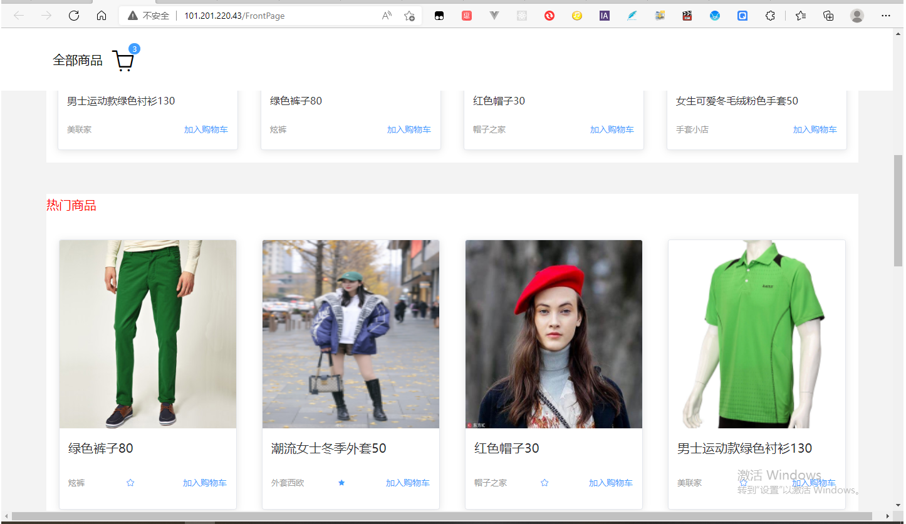

# 这是一个集合PC端和移动端（两套代码）的全栈项目 Vue3+ElementPlus+Vant3+Node+Mangodb
## 项目预览地址 http://101.201.220.43
<a herf="http://101.201.220.43/">购物商城</a>




## 项目涉及
- 前端：PC端：vue3 elementPlus jwt-decode； 移动端： Vant3  postcss
- 后端：nodeJS express mangodb云数据库 passport jsonwebtoken 
## Project setup
```
- 前端项目：npm install  
- 服务器： cd NodeDemo     npm install
```
## 项目启动
```
- 前端 ：npm run serve
- 服务器 ：nodemon server
```
## 项目结构
- 移动端
## 配置移动端---两套代码，通过vue-router路由转发,组件通用和另写
### (1)增加一套入口文件
- mobile文件
- mobile文件下 m_index.html m_main.js APP.vue 
- 增加路由 m_index.js
### (2)增加配置
- 路由m_index.js 增加路由路由守卫,index.js中同理配置
```js
// m_index.js
//路由守卫
/**
 * 判断是否为移动设备，是，则跳转到移动端的路径
 */
 router.beforeEach((to, from, next) => {
  if (/Android|webOS|iPhone|iPod|BlackBerry/i.test(navigator.userAgent)) {
    window.location.href = '/m_index.html'
    // window.location.href = '/Login'
    // to('/m_index');
    // next()
    return
  }
  next()
})

```
## 移动端引入VantUi 组件
- 官方文档 https://youzan.github.io/vant/#/zh-CN/home
- 下载插件 # Vue 3 项目，安装最新版 Vant----npm i vant
- npm i babel-plugin-import -D
- babel.config.js 中添加配置
```js
//babel.config.js
  plugins: [
    ['import', {
      libraryName: 'vant',
      libraryDirectory: 'es',
      style: true
    }, 'vant']
  ]
```
## 移动端 px转rem 
- npm i postcss-px-to-viewport
- 配置 postcss.config.js  具体相关配置看项目中
## 解决elementPlus css样式---用css深度选择器
- :deep(.d1){width:200px}
## 前端拿取token 
- token npm install jwt-decode //解析token
```js
  //解析token
  const decoded = jwt_decode(token);
```